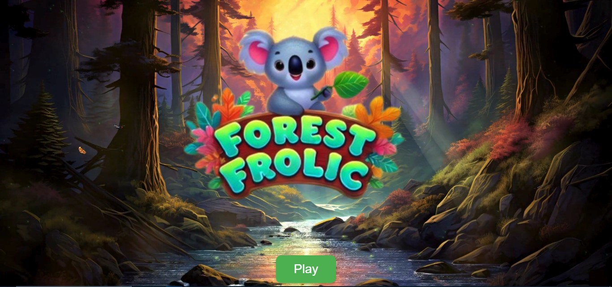
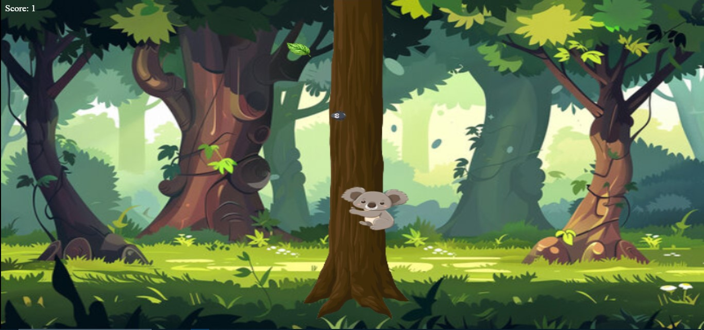
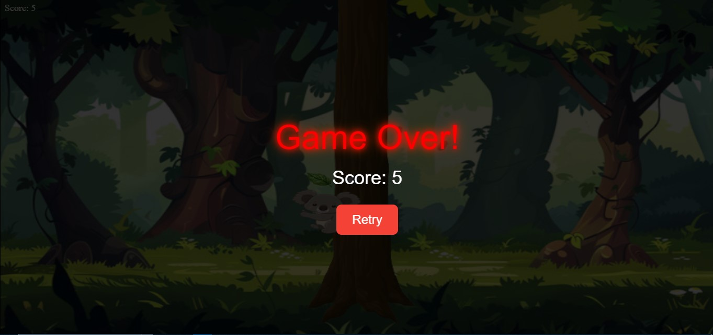

# 🐨 Koala Running Game

A fun and visually engaging side-scrolling JavaScript game where you control a koala collecting leaves while avoiding obstacles. Built with vanilla HTML, CSS, and JavaScript, this game features level transitions, score tracking, and an animated opening video.

---

## 🎮 Gameplay

- The game starts with a video intro and a **Play** button.
- You navigate the **koala** to collect leaves while running through a beautiful forest.
- Each leaf collected increases your score.
- If the koala hits an obstacle, the game ends with a **Game Over** screen and your final score.
- The game has at least **two levels**, with popups introducing each.

---

## 🚀 Features

- 🎥 Opening video scene before gameplay
- 🖼️ Dynamic background using `Background.jpg`
- 📊 Real-time score tracking
- 💀 Game Over screen with retry option
- 🎉 Level transition popups
- ✨ Animated overlays and transitions using CSS
- 📱 Responsive design for different screen sizes

---

## Technologies Used
- HTML
- CSS
- JavaScript
- Kaboom.js

---

## 🧠 Game Logic

1. **Opening Scene**: Plays an intro video with a “Play” button.
2. **Game Start**: When the button is clicked, the canvas and game begin.
3. **Canvas Gameplay**:
   - The koala character is rendered on a canvas with a moving background.
   - Leaves appear at random positions.
   - The player earns points by "touching" the leaves.
4. **Level Progression**:
   - After scoring a certain number of points, a popup welcomes you to the next level.
5. **Game Over**:
   - If the koala collides with an obstacle or certain game conditions are met, the game ends.
   - A Game Over overlay with the final score and a retry button is displayed.

---

## 🖼️ Screenshots

> Add screenshots or GIFs in your project folder (e.g., `images/screenshot1.png`) and reference them like this:

| Start Screen | Gameplay | Game Over |
|-------------|----------|------------|
|  |  |  |

---

## 🛠️ How to Run Locally

1. Clone the repository:

```bash
git clone https://github.com/yourusername/koala-running-game.git
cd koala-running-game
